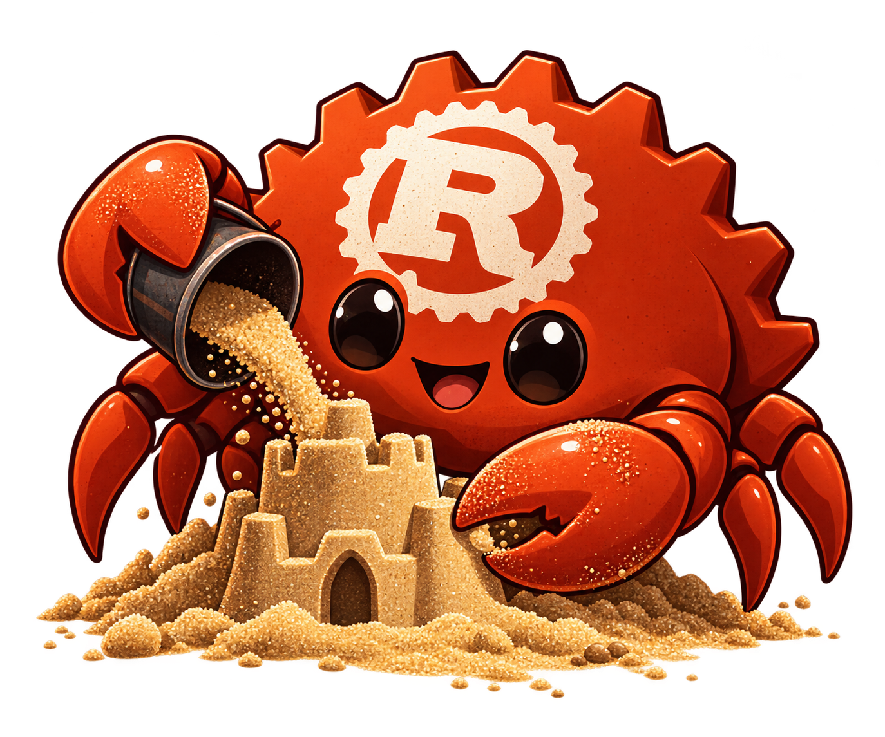

# Rusty Sand



Rusty Sand is a Windows executable-analysis tool written in Rust. It records
process activity, scores intercepted operations, supports interactive approval,
and produces console or JSON reports.

It is not a security boundary. User-mode hooks and Windows Job Objects do not
provide complete filesystem, network, or privilege isolation. Analyze untrusted
programs in a disposable Windows VM.

## In-place WSL launch

From this checkout in your existing WSL terminal:

```sh
cargo build --locked --release --workspace --target x86_64-pc-windows-gnu
./rusty-sand --help
./rusty-sand ./test/rusty_demo_virus.exe
```

The last line is an analysis example, not a build or test command; run untrusted
samples only in a disposable environment. The launcher requires Python 3, WSL
interop, and `wslpath`; the build requires the Windows GNU Rust target and an x64
MinGW compiler/linker already configured. It uses the release executable and DLL
in `target/x86_64-pc-windows-gnu/release` in place: no copy, Windows terminal tab,
or automatic build is required. Targets still execute as **native x64 Windows
processes**, not Linux programs; WOW64 and ARM emulation are unsupported.

The launcher converts Linux executable, `--workdir`, and `--output` paths using
`wslpath`. Absolute Windows paths and arguments after `--` remain unchanged.
Reports default to this checkout's `sandbox_output/report.json`, even when the
launcher is invoked from another directory. `--launcher-debug` explicitly selects
an already-built debug backend; a missing release build never silently falls back.

## Native Windows build

Use a native AMD64 Windows Rust toolchain with its C/C++ build tools. Hook
injection does not support WOW64 or ARM emulation. The repository pins Rust in
`rust-toolchain.toml` and checks in `Cargo.lock`.

```powershell
cargo build --locked --release --workspace
.\target\release\rusty_sand.exe --help
```

Build the whole workspace. Hook-enabled execution requires
`rusty_sand_hooks.dll` beside `rusty_sand.exe`, built for the same architecture.
Building only the root package does not build the DLL.

| Crate | Purpose |
| --- | --- |
| `rusty_sand` | CLI, execution lifecycle, observation, analysis, and reports |
| `rusty_sand_hooks` | Injected Windows DLL and API interceptors |
| `rusty_sand_protocol` | Shared message schemas and operation classification |

Configuration, report handling, scoring, protocol tests, and CLI parsing can run
on non-Windows hosts. Executing a target process requires Windows; the CLI
returns an explicit error rather than substituting a simulated execution.

## Usage

```powershell
.\target\release\rusty_sand.exe C:\Windows\System32\notepad.exe
.\target\release\rusty_sand.exe program.exe --timeout 60 --memory 512
.\target\release\rusty_sand.exe program.exe --format json --output .\reports
.\target\release\rusty_sand.exe program.exe -- --target-option "argument with spaces"
```

| Option | Default | Meaning |
| --- | --- | --- |
| `--internet`, `-i` | Off | Allow connections under the requested policy; also enable DNS |
| `--dns`, `-d` | Off | Allow DNS under the requested policy |
| `--timeout`, `-t` | `300` | Execution deadline in seconds |
| `--memory`, `-m` | `1024` | Process memory limit in MB; zero means unlimited |
| `--workdir`, `-w` | Inherited | Target working directory |
| `--output`, `-o` | `./sandbox_output` | Report directory |
| `--format`, `-f` | `both` | `console`, `json`, or `both` |
| `--verbose`, `-v` | Off | Debug logging unless overridden by `RUST_LOG` |
| `--color` | `auto` | `auto`, `always`, or `never`; `never` also disables effects |
| `--plain` | Off | Disable colors and effects, including with `--color always` |
| `--reduced-motion` | Off | Disable activity animation but retain semantic colors |
| `--log-network` | Off | Log observed network endpoints; not packet capture |
| `--no-registry` | Off | Disable registry monitoring and deny intercepted registry requests |
| `--no-interactive` | Off | Make decisions without interactive prompts |
| `--no-behavior-detection` | Off | Disable event-history analysis |

Arguments after `--` belong to the target, not Rusty Sand. Unknown report formats
are rejected. There is no `--no-internet` flag: the internet policy is disabled by
default. Disabling interactive prompts is not the same as disabling hooks.

Policy settings apply only where an implemented interceptor can enforce them.
They are not a firewall, a restricted desktop, or a virtual filesystem. See
[coverage and limitations](FEATURES.md) before interpreting a report.

## Terminal decisions and cancellation

Configuration, initialization, running, cleanup, risk reviews, and results share
one scrolling presentation on stderr. stdout is not used for runtime human
output; JSON remains a file, so diagnostics never mix into the report. Narrow
terminals wrap fields. Activity indicators show real ongoing work, not estimated
completion percentages, and pause while a prompt owns the terminal. Diagnostics
are buffered during decisions and flushed afterwards; oversized bursts are
bounded and report how many entries were omitted.

Automatic color requires a terminal and respects `NO_COLOR` and `TERM=dumb`.
Redirected output has no animation or automatic colors. `--color always` explicitly
forces colors; `--plain` wins over that choice. `--reduced-motion` preserves color
without animation. WSL forwards terminal width and display hints, while native
Windows queries its stderr console. `RUST_LOG` accepts env_logger level, module,
and regex directives and overrides the `info` default (`debug` with `--verbose`).

Startup accepts only `Y`. Hook decisions use `Y` (once), `A` (this type), `N`
(deny once), `D` (deny this type), or `T` (terminate); empty and unknown keys deny.
Post-event reviews use `A` (accept), `B` (flag suspicious), `C` (continue), or `T`;
these reviews cannot undo observed activity and the target keeps running.
Answers typed before a prompt is armed are discarded, so do not pre-feed approval
scripts. Native input is rendered by Rusty Sand; WSL keeps the caller terminal's
normal echo and the backend does not echo pipe input a second time.

Ctrl-C cancels even with `--no-interactive`. Interactive input EOF cancels during
startup, injection, or execution, not just during prompts. With `--no-interactive`
before `--`, the WSL launcher leaves its backend pipe open after ordinary stdin
EOF, so redirected runs such as `./rusty-sand program.exe --no-interactive < /dev/null`
can complete normally. Target arguments after `--` do not select this behavior.
SIGINT and SIGTERM still close the backend pipe in either mode, and the launcher
waits for cleanup. Actual backend pipe closure remains a cancellation signal.
Cancellation terminates the target job and joins input and observation workers
before reporting the failure.

## Reports and library use

JSON output is saved to `OUTPUT/report.json`. A report includes the executable,
start and end timestamps, duration, exit code, effective configuration, and
ordered events. Hook events describe intercepted requests; observations describe
activity detected separately. Both may refer to the same operation, so event
counts are not counts of unique completed actions.

The Windows library entry point is `execute_sandboxed`. Configuration is built
through `SandboxConfig`; results use `SandboxReport`. `print_summary()` retains
its stdout library API; `write_summary(writer, policy)` is fallible and supports
the same rendering policy as the CLI. Risk categories expose
`ThreatCategory::as_str()` for plain-text labels; the unused decorative
`color_code()` helper has been removed. See the compiling examples:

- [Basic usage](examples/basic_usage.rs): launch Notepad and save a report.
- [Advanced monitoring](examples/advanced_monitoring.rs): observe a benign
  PowerShell process listing with hooks explicitly disabled through the library.

Run examples manually on Windows after building the workspace. They launch real
programs and are not substitutes for unit tests.

## Development

```sh
cargo fmt --all -- --check
cargo check --locked --workspace --all-targets
cargo clippy --locked --workspace --all-targets -- -D warnings
cargo test --locked --workspace --all-targets
```

Run these on Windows to cover the platform implementation. Portable tests on
Linux exercise domain logic and protocol behavior but do not validate Win32
calls, DLL injection, or interception. The CI configuration checks both surfaces.
It also runs the portable hook-boundary tests under Miri.

Tests live in `tests/unit/`, `rusty_sand_hooks/tests/unit/`, and
`crates/protocol/tests/`. Implementation files contain test-module references,
not embedded test bodies. Keep new tests in those dedicated directories.

Use descriptive names, explicit ownership, and focused modules. Comments should
explain non-obvious protocol, lifetime, or operating-system constraints in coherent
blocks; avoid narrating individual statements. Keep formatting changes separate
from behavior changes when reviewing a patch. Tests should observe behavior,
including error and cleanup paths, without relying on fixed sleeps.

The implementation map and lifecycle constraints are in
[EXECUTION_FLOW.md](EXECUTION_FLOW.md).

## License

[MIT](LICENSE).
